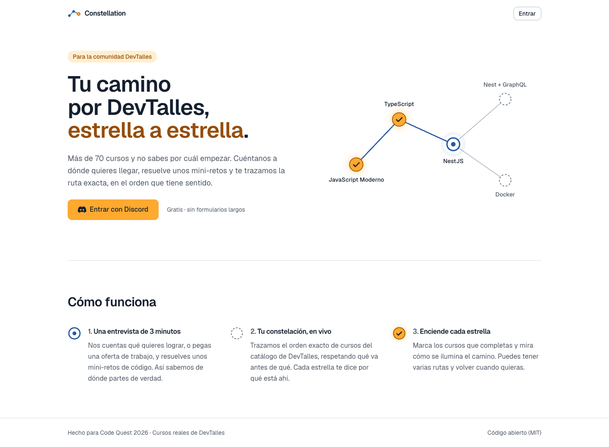
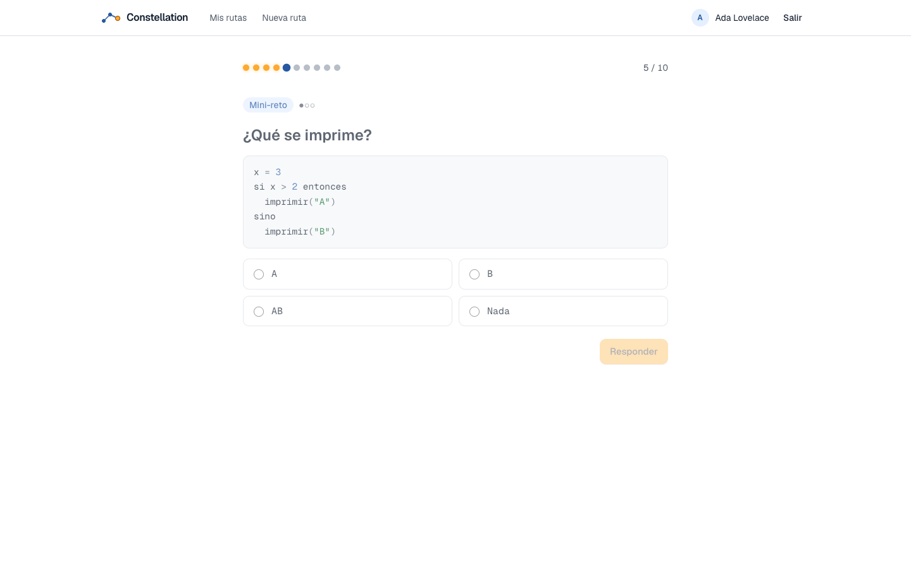
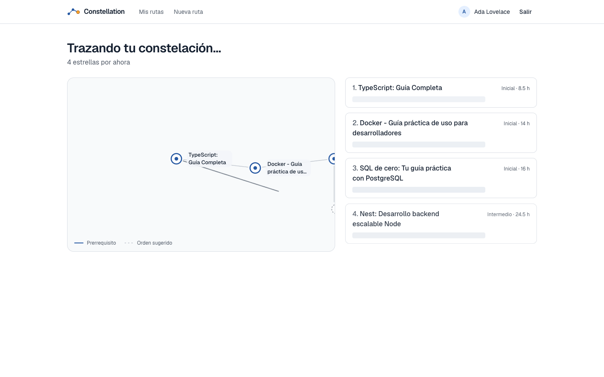
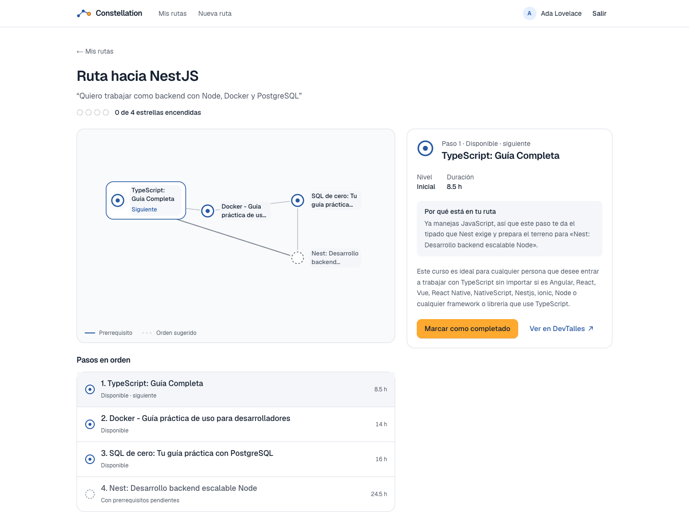
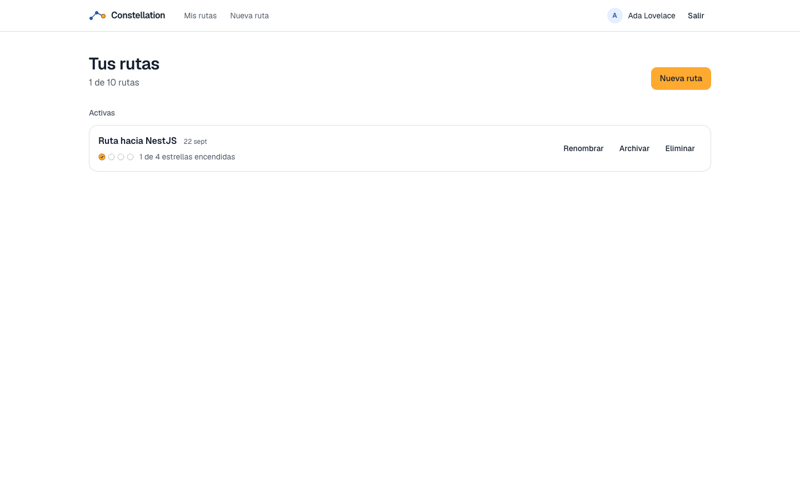

# DevTalles Constellation

Rutas de aprendizaje personales sobre el catálogo real de [DevTalles](https://cursos.devtalles.com). Entras con Discord, pasas una entrevista corta con mini-retos de código y obtienes una **constelación**: tus cursos en el orden que tiene sentido, con el porqué de cada paso, que vas encendiendo a medida que los completas.

Proyecto para la hackathon **Code Quest 2026** de DevTalles.

- **App:** https://constellation.waldirmaidana.com
- **API:** https://backend.constellation.waldirmaidana.com/v1



## Qué resuelve

El catálogo tiene más de 70 cursos y nadie sabe por dónde empezar. Constellation te pregunta a dónde quieres llegar (con tus palabras, o pegando una oferta de trabajo), mide lo que ya sabes con mini-retos verificables, y traza la ruta exacta: solo cursos que existen, en un orden que respeta los prerrequisitos y sin repetir lo que ya dominas.

| Entrevista con mini-retos | Generación en vivo |
|---|---|
|  |  |

| Constelación y progreso | Tus rutas |
|---|---|
|  |  |

## Cómo funciona

```
Discord OAuth ──► Entrevista adaptativa ──► SkillProfile ──► PathPlanner ──► Constelación
                  (preguntas + retos)       (niveles y        (determinista)   (guardada, con
                                             objetivos)                         progreso)
```

1. **Entrevista adaptativa.** Objetivo en texto libre, área, tecnología, autoevaluación derivada del catálogo y mini-retos de código. La escalera sube de dificultad si aciertas y se detiene si fallas: como máximo 10 preguntas.
2. **Perfil.** Niveles por skill (0–3) y las skills que quieres aprender.
3. **`PathPlanner`, determinista.** Elige un curso por objetivo, añade los prerrequisitos que te faltan, quita lo que ya dominas y ordena topológicamente. **Es la única pieza que decide qué cursos entran.**
4. **Constelación.** Se dibuja en streaming (SSE) mientras se genera, se guarda y la enciendes curso a curso.

### La IA no decide la ruta

Decisión central del proyecto ([ADR-0001](docs/adr/0001-ia-interpreta-motor-determinista-genera.md)): un LLM que arma la ruta puede inventar cursos o ignorar prerrequisitos. Aquí Claude **interpreta y explica**, y un motor determinista **genera**:

- **Interpretar:** de tu texto libre o de una oferta de trabajo saca las tecnologías que necesitas, y deduce niveles que la entrevista no midió. Nunca pisa lo que midieron los retos; su salida se valida contra los slugs del catálogo.
- **Explicar:** redacta el porqué de cada paso **ya decidido**. No puede añadir ni quitar cursos.
- **Sin IA funciona igual.** Ante error, timeout o rechazo se usan las reglas, y la base guarda quién respondió (`interpreted_by`, `generated_by`). Con `LLM_PROVIDER=rules` no se hace ninguna llamada externa.

## Stack

| Servicio | Tecnología |
|---|---|
| `web` | Next.js 16 (App Router, `standalone`), React 19, Tailwind 4, React Flow, Motion |
| `api` | NestJS 11, TypeORM 1.x, PostgreSQL 18, Zod, JWT en cookie, SSE |
| IA | SDK de Anthropic, `claude-opus-5` con salida estructurada, detrás de puertos con adaptador `rules` |
| Infra | AWS Lightsail · Nginx + certbot · PM2 · GitHub Actions |

Arquitectura por contextos (`identity`, `catalog`, `assessment`, `learning-path`) con capas `domain / application / infrastructure / presentation`.

## Correrlo en local

Necesitas Node ≥ 22.13, pnpm 11 y PostgreSQL.

```bash
# Base de datos
createdb constellation
psql -d postgres -c "create role constellation login password 'constellation'"

# API (puerto 3001)
cd api
cp .env.example .env          # completa DISCORD_* y JWT_SECRET
pnpm install
pnpm migration:run
pnpm seed                     # catálogo: 74 cursos y 63 skills
pnpm start:dev

# Web (puerto 3000)
cd ../web
cp .env.example .env.local
pnpm install
pnpm dev
```

Para el login necesitas una app de Discord con la redirect URI `http://localhost:3001/v1/auth/discord/callback`. La IA es opcional: sin `LLM_PROVIDER=claude` todo funciona por reglas.

### Comprobaciones

```bash
cd api && pnpm lint && pnpm test && pnpm test:e2e   # e2e contra Postgres real
cd web && pnpm lint && pnpm build
node tools/catalog/validate-catalog.mjs             # catálogo: referencias, DAG, niveles
```

## El catálogo

`api/src/catalog/infrastructure/seed/catalog.json` tiene 74 cursos reales con sus skills, niveles y prerrequisitos. Sale de un snapshot del sitio público de DevTalles (`tools/catalog/extract-devtalles.mjs`), curado a mano: los prerrequisitos parten de las **rutas oficiales** que DevTalles publica ([ADR-0004](docs/adr/0004-catalogo-extraido-offline-del-sitio-publico.md)). La app nunca consulta devtalles.com en ejecución, y un validador comprueba que el grafo no tenga ciclos.

## Documentación

| Archivo | Qué contiene |
|---|---|
| [`CLAUDE.md`](CLAUDE.md) | Verdad operativa: invariantes, comandos, gotchas y Definition of Done |
| [`PRODUCT.md`](PRODUCT.md) · [`DESIGN.md`](DESIGN.md) | Estrategia de producto y sistema visual |
| [`specs/00_especificaciones.md`](specs/00_especificaciones.md) | Diseño congelado: esquema, contratos y criterios de aceptación |
| [`specs/02_plan_implementacion.md`](specs/02_plan_implementacion.md) | Plan por fases, con desvíos y trazabilidad |
| [`docs/adr/`](docs/adr/) | Decisiones con su porqué y las alternativas descartadas |
| [`deploy/README.md`](deploy/README.md) | Despliegue, variables de producción y respaldos |

## Licencia

[MIT](LICENSE).
