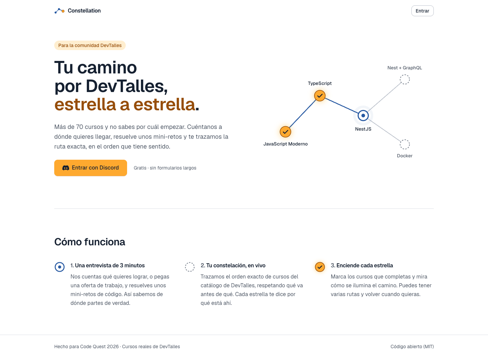
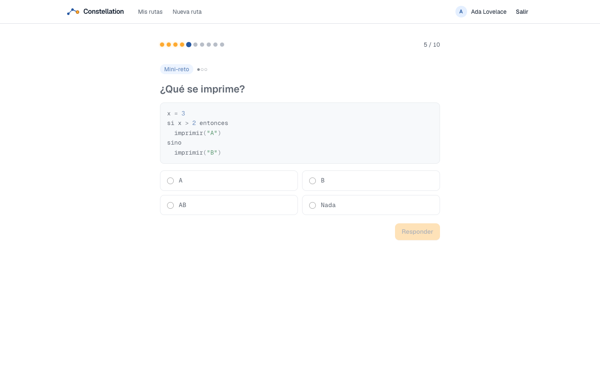
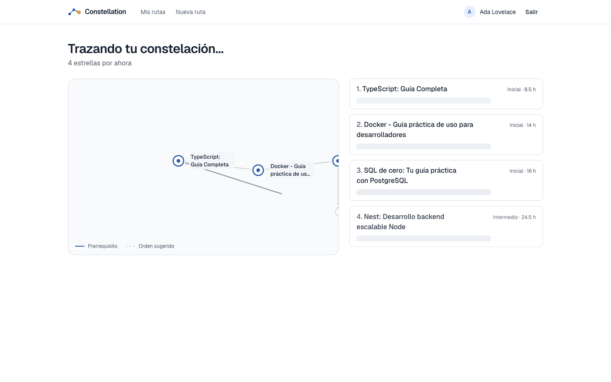
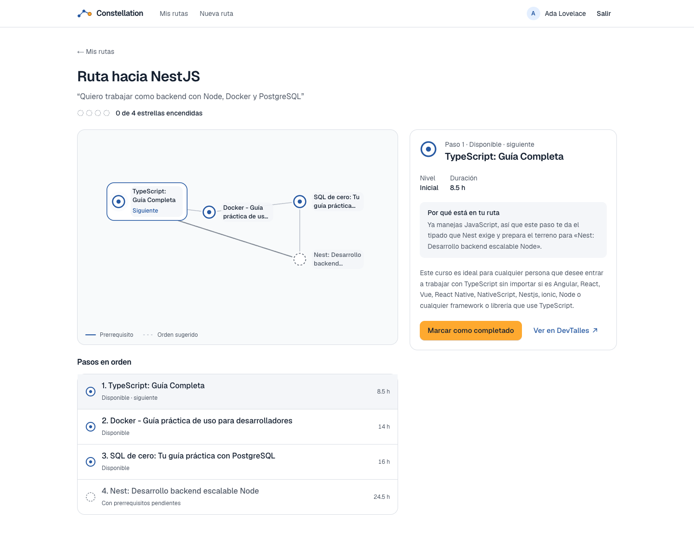
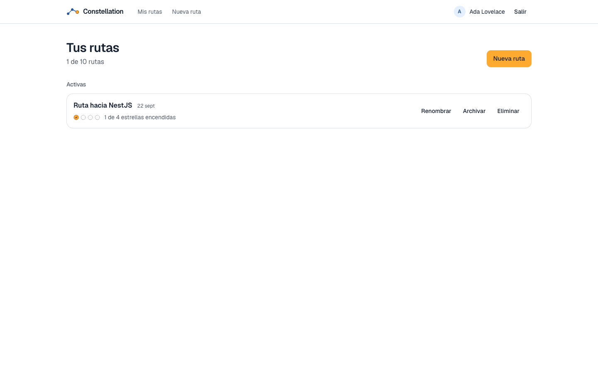

<h1 align="center">DevTalles Constellation</h1>

<p align="center">
  <strong>Una entrevista con IA de 3 minutos convierte 74 cursos sueltos en tu ruta de aprendizaje.</strong>
</p>

<p align="center">
  
  
  
  
  
  
  
</p>

<p align="center">
  <a href="https://constellation.waldirmaidana.com">App</a> ·
  <a href="https://backend.constellation.waldirmaidana.com/v1">API</a> ·
  <a href="https://github.com/zidjian/constellation">Repositorio</a>
</p>

---

## Índice

- [Descripción](#descripción)
- [La entrevista con IA](#la-entrevista-con-ia)
- [Capturas](#capturas)
- [Cómo funciona](#cómo-funciona)
- [Arquitectura](#arquitectura)
- [Correr el proyecto](#correr-el-proyecto)
  - [Requisitos](#requisitos)
  - [1. Base de datos](#1-base-de-datos)
  - [2. API](#2-api)
  - [3. Web](#3-web)
  - [4. Comprobaciones](#4-comprobaciones)
- [Variables de entorno](#variables-de-entorno)
  - [API (`api/.env`)](#api-apienv)
  - [Web (`web/.env.local`)](#web-webenvlocal)
- [El catálogo](#el-catálogo)
- [Estructura del proyecto](#estructura-del-proyecto)
- [Tecnologías](#tecnologías)
- [Despliegue](#despliegue)
- [Documentación](#documentación)
- [Autor](#autor)
- [Licencia](#licencia)

---

## Descripción

El catálogo de [DevTalles](https://cursos.devtalles.com) tiene más de 70 cursos y nadie sabe por dónde empezar. Constellation lo resuelve con una **entrevista adaptativa con IA**: te pregunta a dónde quieres llegar —con tus palabras, o pegando una oferta de trabajo—, mide lo que ya sabes con mini-retos de código verificables, y traza la ruta exacta.

El resultado es una **constelación**: tus cursos en el orden que respeta los prerrequisitos, con el porqué de cada paso, que vas encendiendo estrella a estrella a medida que los completas.

Proyecto para la hackathon **Code Quest 2026** de DevTalles.

---

## La entrevista con IA

Es el corazón del producto y la única puerta de entrada a una ruta.

| | |
|---|---|
| **Adaptativa** | La escalera sube de dificultad si aciertas y se detiene si fallas. Como máximo 10 preguntas, unos 3 minutos. |
| **Mide, no pregunta** | Mini-retos de código verificables, no una autoevaluación en la que todo el mundo se pone 7 de 10. |
| **Entiende tu objetivo** | Escribe a dónde quieres llegar con tus palabras, o pega una oferta de trabajo entera: Claude saca de ahí las tecnologías. |
| **Empieza por lo tuyo** | Los retos arrancan por aquello a lo que aspiras, no por lógica genérica: quien elige Kubernetes recibe retos de Kubernetes. |
| **Simulacro con reclutador** | Modo opcional (`RECRUITER_ENABLED=true`): una entrevista conversacional con informe final. |
| **Sin IA funciona igual** | Ante error, timeout o rechazo se responde por reglas y la base guarda quién respondió de verdad. |

### La IA no decide la ruta

Decisión central del proyecto ([ADR-0001](docs/adr/0001-ia-interpreta-motor-determinista-genera.md)): un LLM que arma la ruta puede inventar cursos o ignorar prerrequisitos. Aquí Claude **interpreta y explica**, y un motor determinista **genera**.

- **Interpretar:** de tu texto libre o de la oferta saca las tecnologías, y deduce niveles que la entrevista no midió. Nunca pisa lo que midieron los retos, y su salida se valida contra los slugs del catálogo.
- **Explicar:** redacta el porqué de cada paso **ya decidido**. No puede añadir ni quitar cursos.
- **Trazabilidad:** `interpreted_by` y `generated_by` guardan si respondió Claude o las reglas. Con `LLM_PROVIDER=rules` no se hace ninguna llamada externa.

---

## Capturas



| Entrevista con mini-retos | Generación en vivo |
|---|---|
|  |  |

| Constelación y progreso | Tus rutas |
|---|---|
|  |  |

---

## Cómo funciona

```
Cuenta (correo o Discord) ──► Entrevista con IA ──► SkillProfile ──► PathPlanner ──► Constelación
                            (preguntas + retos)    (niveles y       (determinista)   (guardada, con
                                                    objetivos)                        progreso)
```

1. **Entrevista adaptativa.** Objetivo en texto libre, área, tecnología, autoevaluación derivada del catálogo y mini-retos de código.
2. **Perfil.** Niveles por skill (0–3) y las skills que quieres aprender.
3. **`PathPlanner`, determinista.** Elige un curso por objetivo, añade los prerrequisitos que faltan, quita lo que ya dominas y ordena topológicamente. **Es la única pieza que decide qué cursos entran.**
4. **Constelación.** Se dibuja en streaming (SSE) mientras se genera, se guarda y la enciendes curso a curso.

---

## Arquitectura

```
constellation/
├── api/     # NestJS 11 + TypeORM + PostgreSQL — puerto 3001
├── web/     # Next.js 16 (App Router, standalone) — puerto 3000
├── tools/   # extractor offline del catálogo de DevTalles
├── deploy/  # despliegue en Lightsail: Nginx, PM2, respaldos
├── docs/    # ADRs y capturas
└── specs/   # diseño congelado y plan de implementación
```

La API se organiza por **contextos** (`identity`, `catalog`, `assessment`, `learning-path`), cada uno con capas `domain / application / infrastructure / presentation`.

---

## Correr el proyecto

### Requisitos

| Herramienta | Versión |
|---|---|
| Node | ≥ 22.13 (la API pide ≥ 24.11 para desarrollo) |
| pnpm | 11 |
| PostgreSQL | ≥ 16 (producción usa 18) |

Nada más: la IA es opcional y el catálogo es un seed versionado, sin llamadas a devtalles.com.

### 1. Base de datos

```bash
createdb constellation
psql -d postgres -c "create role constellation login password 'constellation'"
```

### 2. API

```bash
cd api
cp .env.example .env     # completa DISCORD_* y JWT_SECRET
pnpm install
pnpm migration:run       # crea el esquema (synchronize está desactivado siempre)
pnpm seed                # catálogo: 74 cursos y 63 skills, idempotente
pnpm start:dev           # http://localhost:3001
```

### 3. Web

```bash
cd web
cp .env.example .env.local
pnpm install
pnpm dev                 # http://localhost:3000
```

Abre `http://localhost:3000`, crea una cuenta con correo y haz la entrevista.

**Lo que puedes saltarte:**

- **Correo.** Sin `RESEND_API_KEY`, el enlace de verificación y el de recuperación se escriben en el log de la API.
- **Discord.** Solo hace falta para el botón «Entrar con Discord». Necesita una app con la redirect URI `http://localhost:3001/v1/auth/discord/callback` registrada exacta.
- **IA.** Con `LLM_PROVIDER=rules` (el valor por defecto) todo el flujo funciona sin ninguna llamada externa. Para la entrevista con Claude: `LLM_PROVIDER=claude` y `ANTHROPIC_API_KEY`.

### 4. Comprobaciones

```bash
cd api && pnpm lint && pnpm test && pnpm test:e2e   # e2e contra Postgres real
cd web && pnpm lint && pnpm test && pnpm build
node tools/catalog/validate-catalog.mjs             # referencias, DAG y niveles del catálogo
```

---

## Variables de entorno

### API (`api/.env`)

El arranque las valida con Zod y falla listando cada variable inválida.

| Variable | Obligatoria | Por defecto | Para qué |
|---|---|---|---|
| `NODE_ENV` | no | `development` | Modo de ejecución |
| `PORT` | no | `3001` | Puerto de la API |
| `DATABASE_URL` | **sí** | — | Conexión a PostgreSQL |
| `WEB_ORIGIN` | **sí** | — | Origen exacto de la web para CORS con credenciales (nunca `*`) |
| `COOKIE_DOMAIN` | no | vacío | Vacío en local; en producción `.constellation.waldirmaidana.com` |
| `JWT_SECRET` | **sí** | — | Firma de la sesión, mínimo 32 caracteres (`openssl rand -hex 32`) |
| `DISCORD_CLIENT_ID` | **sí** | — | App de Discord |
| `DISCORD_CLIENT_SECRET` | **sí** | — | App de Discord |
| `DISCORD_CALLBACK_URL` | **sí** | — | Redirect URI, idéntica a la registrada |
| `RESEND_API_KEY` | no | vacío | Envío de correo; sin ella, los enlaces van al log |
| `MAIL_FROM` | no | `Constellation <onboarding@resend.dev>` | Remitente |
| `PATH_STREAM_DELAY_MS` | no | `150` | Pausa entre eventos del stream de generación |
| `LLM_PROVIDER` | no | `rules` | `rules` (sin red) o `claude` |
| `ANTHROPIC_API_KEY` | con `claude` | vacío | Clave de Anthropic |
| `ANTHROPIC_MODEL` | no | `claude-opus-5` | Interpreta la entrevista y redacta el porqué |
| `RECRUITER_ENABLED` | no | `false` | Simulacro de entrevista con reclutador |
| `ANTHROPIC_INTERVIEW_MODEL` | no | `claude-sonnet-5` | Conduce la charla del simulacro |
| `LLM_TIMEOUT_MS` | no | `8000` | Tope del intérprete, que bloquea la respuesta |
| `LLM_RATIONALE_TIMEOUT_MS` | no | `25000` | Tope del redactor del porqué |
| `LLM_RECRUITER_TIMEOUT_MS` | no | `20000` | Tope de un turno del simulacro |
| `LLM_REPORT_TIMEOUT_MS` | no | `60000` | Tope del informe final del simulacro |

### Web (`web/.env.local`)

| Variable | Obligatoria | Por defecto | Para qué |
|---|---|---|---|
| `NEXT_PUBLIC_API_URL` | **sí** | — | URL pública de la API. **Se incrusta en build time**: el build de producción se hace ya con la URL real |
| `API_INTERNAL_URL` | no | `NEXT_PUBLIC_API_URL` | URL que usa el servidor de Next; en producción evita salir a internet |

---

## El catálogo

`api/src/catalog/infrastructure/seed/catalog.json` tiene 74 cursos reales con sus skills, niveles y prerrequisitos. Sale de un snapshot del sitio público de DevTalles (`tools/catalog/extract-devtalles.mjs`), curado a mano: los prerrequisitos parten de las **rutas oficiales** que DevTalles publica ([ADR-0004](docs/adr/0004-catalogo-extraido-offline-del-sitio-publico.md)).

La app **nunca** consulta devtalles.com en ejecución, y un validador comprueba que el grafo no tenga ciclos.

En `/cursos` el catálogo se explora con buscador (por nombre, tema o tecnología, sin tildes), filtros agrupados por área, nivel y estado, y paginación de 12 en 12.

---

## Estructura del proyecto

```
api/src/
├── identity/        # login con Discord y con correo, sesión (JWT en cookie), perfil
├── catalog/         # cursos, skills y prerrequisitos (seed versionado)
├── assessment/      # entrevista adaptativa → SkillProfile
├── learning-path/   # generación de rutas, pasos y progreso
└── shared/          # config, errores, formato de respuesta, puertos transversales

web/src/
├── app/             # / · /entrar · /registro · /assessment · /paths · /cursos · /completados · /perfil
├── features/        # assessment · catalog · constellation · paths · auth · landing
├── components/      # sistema visual (botones, estrella, marca)
└── lib/             # cliente de API en servidor y en navegador
```

---

## Tecnologías

**Backend:** NestJS 11 · TypeORM 1.x · PostgreSQL · Zod · JWT en cookie httpOnly · SSE · Jest

**Frontend:** Next.js 16 (App Router, `standalone`) · React 19 · Tailwind 4 · Motion · constelación en SVG propio · Vitest

**IA:** SDK de Anthropic · `claude-opus-5` con salida estructurada · adaptador `rules` detrás de los mismos puertos

**Infra:** AWS Lightsail · Nginx + certbot · PM2 · GitHub Actions

---

## Despliegue

`main` es producción y despliega solo por GitHub Actions. Los detalles —Nginx, PM2, puertos, variables de producción y respaldos— están en [`deploy/README.md`](deploy/README.md).

Ramas: `main` (producción), `develop` (integración), `feature/*` y `fix/*` por PR, con Conventional Commits.

---

## Documentación

| Archivo | Qué contiene |
|---|---|
| [`CLAUDE.md`](CLAUDE.md) | Verdad operativa: invariantes, comandos, gotchas y Definition of Done |
| [`PRODUCT.md`](PRODUCT.md) · [`DESIGN.md`](DESIGN.md) | Estrategia de producto y sistema visual |
| [`specs/00_especificaciones.md`](specs/00_especificaciones.md) | Diseño congelado: esquema, contratos y criterios de aceptación |
| [`specs/02_plan_implementacion.md`](specs/02_plan_implementacion.md) | Plan por fases, con desvíos y trazabilidad |
| [`docs/adr/`](docs/adr/) | Decisiones con su porqué y las alternativas descartadas |
| [`deploy/README.md`](deploy/README.md) | Despliegue, variables de producción y respaldos |

---

## Autor

**Waldir Maidana** — [github.com/zidjian](https://github.com/zidjian) · [waldirmaidana.com](https://waldirmaidana.com)

---

## Licencia

[MIT](LICENSE).
